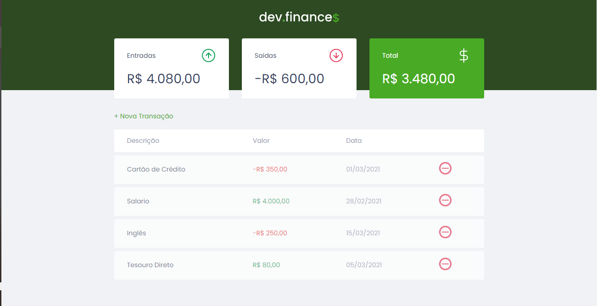

<h1 align="center">
  
</h1>

<p align="center">
  <a href="#techs">Techs<a/> |
  <a href="#projeto">Projeto<a/> |
  <a href="#destaque">Destaque<a/> |
  <a href="#testes">Testes<a/>
</p>

<br>

<p align="center">
  
</p>

## 💻Techs
Projeto realizado com a abordagem das seguintes tecnologias para aprimorar os estudos sobre o front-end<br>

&nbsp;&nbsp;
&nbsp;&nbsp;
&nbsp;&nbsp;


## 📖Projeto
<p>
  Aplicação de controle financeiro, para utilização dos gastos e ganhos, realizando de forma simples um orçamento pessoal :heavy_dollar_sign: 
<p/>

## 🧪Testes

[](https://github.com/santosvini/devfinance/actions/workflows/cypress.yml)

- Modo GUI : ``` yarn cy:open ```
- Modo Headless : ``` yarn cy:test ```

https://user-images.githubusercontent.com/46813491/222936517-57256453-ec34-4f5d-9874-3142bdb707ea.mp4

## 🎆Destaque
Feito como prática de estudo com a [Rocketseat](https://maratonadiscover.rocketseat.com.br/inscricao) :wave:
